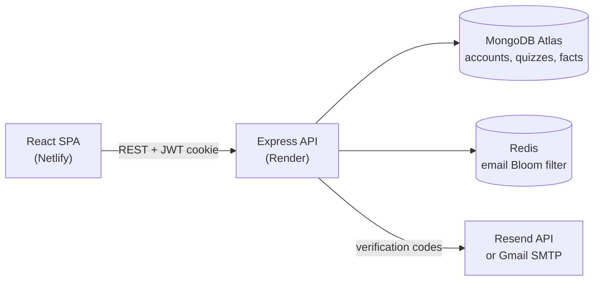

<div align="center">

# KuisAnak

**A full-stack quiz and learning web app for primary-school children in Indonesia**

**[Live demo](https://ian-joseph.netlify.app/quizanak/build/index.html)** · [Portfolio](https://ian-joseph.netlify.app/)


</div>

## About

KuisAnak ("kids' quiz" in Indonesian) lets children take short multiple-choice quizzes and read illustrated fact articles about animals, space and history. Players create an account, verify it by email and can review the scores of their past attempts. The interface is in Bahasa Indonesia.

The project covers the full stack: a React single-page app, a REST API built with Express, MongoDB for accounts and content, and Redis for fast sign-up checks, deployed on Netlify and Render.

## Features

- **Quizzes** on animals, math, language and other topics. Each attempt serves 10 questions in random order, some with pictures.
- **Instant feedback** after every answer, a final score, and three suggested quizzes from the same category.
- **Fact articles** about animals, space and "weird but true" history, illustrated with photos.
- **Accounts** with sign-up, email verification codes, login/logout and a personal score history.
- **Protected pages**: quizzes and articles require a verified account, and unverified users are sent to the verification screen.
- **Responsive UI** built with React-Bootstrap and a custom glassmorphism theme.

## Tech stack

| Layer | Technologies |
| --- | --- |
| Frontend | React 18, React Router 6, React-Bootstrap (Bootstrap 5), Axios |
| Backend | Node.js, Express 4, JSON Web Tokens, bcrypt, Nodemailer, Resend API |
| Data | MongoDB Atlas (official Node.js driver), Redis with the RedisBloom module |
| Testing & CI | Jest, React Testing Library, Mock Service Worker, Jenkins |
| Hosting | Netlify (frontend), Render (API) |

## Architecture



## Technical highlights

- **Bloom filter for email checks.** On startup the API loads every registered email into a RedisBloom filter. Sign-up checks ask Redis first and only query MongoDB when the filter reports a possible match, so most new addresses never touch the database.
- **Email delivery on a restricted host.** Render's free tier blocks outbound SMTP ports, so verification emails go through Resend's HTTPS API, with Gmail via Nodemailer (App Password or OAuth2) as the fallback. Emails are sent in the background, so sign-up requests don't wait on the mail server.
- **Resilient API client.** A shared Axios setup sends credentials with every request, allows 30 seconds for the API to wake from a cold start, and turns network failures into readable error messages.
- **Session handling.** Logging in issues a JWT in a cookie. Each protected page checks it through `/api/verifyToken` and redirects to login or email verification as needed.

## Getting started

### Prerequisites

- Node.js 18 or later (the API uses the built-in `fetch`)
- A MongoDB database, such as a free Atlas cluster
- Redis with the RedisBloom module, such as Redis Stack locally or Upstash
- Optional: a Resend API key or a Gmail App Password for sending email. Without one, verification codes are still printed to the API log.

### Setup

```bash
git clone https://github.com/ianjhh/quizanak.git
cd quizanak
npm install                              # also installs backend/ through postinstall

cp .env.example .env
cp backend/.env.example backend/.env     # then fill in your own values
```

Start the API and the React app in two terminals:

```bash
cd backend && npm start                  # API on http://localhost:5000
```

```bash
npm start                                # app on http://localhost:3000
```

Quiz and fact content is stored in MongoDB (the `imgupload` database, in the `quiz`, `animalFact`, `spaceFact` and `historyFact` collections). The repository doesn't include seed data, so a new database starts empty.

### Scripts

| Command | Description |
| --- | --- |
| `npm start` | Run the React dev server |
| `npm test` | Run the frontend tests in watch mode |
| `npm run build` | Create a production build in `build/` |
| `cd backend && npm start` | Run the API |

## Project structure

```
quizanak/
├── backend/
│   ├── backend.js          # Express API: auth, quizzes, facts, email
│   └── .env.example
├── public/                 # HTML template, icons, web manifest
├── src/
│   ├── index.js            # routes and Axios configuration
│   ├── Home.js             # landing page, login panel, score history
│   ├── QuizList.js         # quiz catalogue
│   ├── Quiz.js             # quiz player
│   ├── *Facts.js, *Fact.js # fact categories and articles
│   ├── Register.js, Login.js, Verify.js
│   ├── assets/images/      # quiz and article images
│   └── *.test.js           # component tests
├── Jenkinsfile             # CI pipeline: install, test, build
└── .env.example
```

## Testing

`npm test` runs the component tests with Jest and React Testing Library, using Mock Service Worker to mock API responses. The `Jenkinsfile` defines a CI pipeline that installs dependencies, runs the tests and builds the production bundle.

## Author

Built by [@ianjhh](https://github.com/ianjhh) · [Portfolio](https://ian-joseph.netlify.app/) · [LinkedIn](https://linkedin.com/in/ianjhh)
