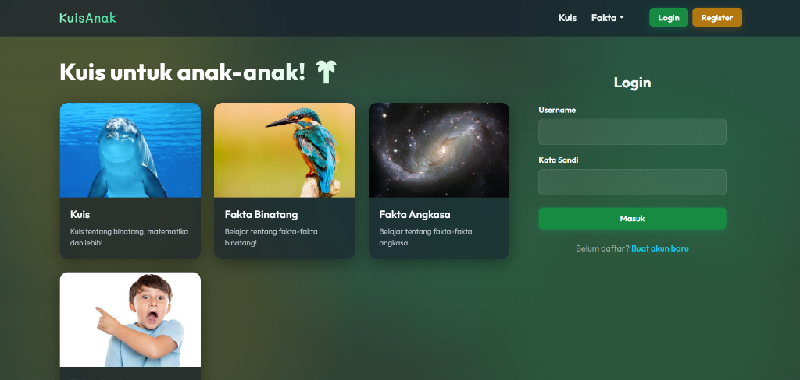
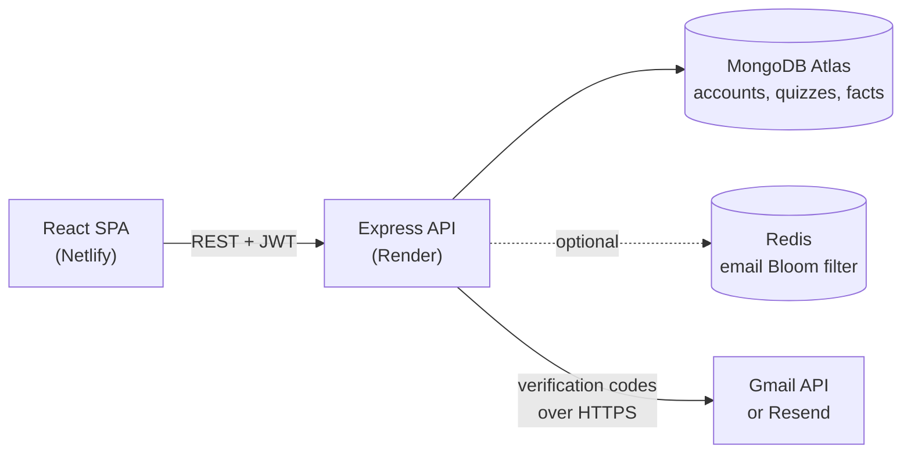

<div align="center">

# KuisAnak

**A full-stack quiz and learning web app for primary-school children in Indonesia**

**[Live demo](https://ian-joseph.netlify.app/quizanak/build/index.html)** · [Portfolio](https://ian-joseph.netlify.app/)




</div>

## About

KuisAnak ("kids' quiz" in Indonesian) lets children take short multiple-choice quizzes and read illustrated fact articles about animals, space and history. Players create an account, verify it by email and can review the scores of their past attempts. The interface is in Bahasa Indonesia.

The project covers the full stack: a React single-page app, a REST API built with Express, MongoDB for accounts and content, and an optional Redis Bloom filter for fast sign-up checks, deployed on Netlify and Render.

## Features

- **Quizzes** on animals, math, language and other topics. Each attempt serves 10 questions in random order, some with pictures.
- **Instant feedback** after every answer, a final score, and three suggested quizzes from the same category.
- **Fact articles** about animals, space and "weird but true" history, illustrated with photos.
- **Accounts** with sign-up, email verification codes, login/logout and a personal score history.
- **Protected pages**: quizzes and articles require a verified account, and unverified users are sent to the verification screen.
- **Responsive UI** built with React-Bootstrap and a custom glassmorphism theme.

## Tech stack

| Layer | Technologies |
| --- | --- |
| Frontend | React 18, React Router 6, React-Bootstrap (Bootstrap 5), Axios |
| Backend | Node.js, Express 4, JSON Web Tokens, bcryptjs, Gmail API, Resend, Nodemailer |
| Data | MongoDB Atlas (official Node.js driver), Redis with the RedisBloom module (optional) |
| Testing & CI | Jest, React Testing Library, Node's built-in test runner, Jenkins |
| Hosting | Netlify (frontend), Render (API) |

## Architecture



## Technical highlights

- **Email delivery on a restricted host.** Render's free tier blocks outbound SMTP, so verification codes go out through the Gmail API over HTTPS using an OAuth refresh token, with Resend and SMTP as fallbacks. Every attempt has a timeout, the result is reported to the user, and at startup the API logs whether each configured transport actually works.
- **Server-side grading.** The browser never receives the answers. Each answer is checked by the API for instant feedback, and the final score is computed and stored on the server for the signed-in user.
- **Sessions that work across sites.** The frontend and API live on different domains, where Safari and iOS block third-party cookies. The API returns its JWT in the response as well as in an httpOnly cookie, and the app sends it back as a Bearer header.
- **Bloom filter for email checks.** When Redis is configured, the API keeps a RedisBloom filter of registered emails, so most "is this email free?" checks skip MongoDB. If Redis is down, checks fall back to MongoDB instead of blocking sign-up.
- **Verification codes that can't be guessed or abused.** 6-digit codes are tied to the signed-in user, lock after 5 wrong attempts, expire after 24 hours, and can be re-sent once a minute.

## Getting started

### Prerequisites

- Node.js 18 or later (the API uses the built-in `fetch` and test runner)
- A MongoDB database, such as a free Atlas cluster
- Optional: Redis with the RedisBloom module (Redis Stack or Redis Cloud)
- Optional: Gmail API credentials or a Resend key for sending email ([setup guide](docs/email-setup.md)). Without them, verification codes are printed to the API log.

### Setup

```bash
git clone https://github.com/ianjhh/quizanak.git
cd quizanak
npm install                              # also installs backend/ through postinstall

cp .env.example .env
cp backend/.env.example backend/.env     # set MONGODB_URI and JWT_SECRET at least
cd backend && npm run seed && cd ..      # load starter quizzes and fact articles
```

Start the API and the React app in two terminals:

```bash
cd backend && npm start                  # API on http://localhost:5000
```

```bash
npm start                                # app on http://localhost:3000
```

Content lives in MongoDB (the `imgupload` database: `quiz`, `animalFact`, `spaceFact` and `historyFact`). `npm run seed` adds six starter quizzes and three articles, and is safe to run again.

### Scripts

| Command | Description |
| --- | --- |
| `npm start` | Run the React dev server |
| `npm test` | Run the frontend tests |
| `npm run build` | Create a production build in `build/` |
| `cd backend && npm start` | Run the API |
| `cd backend && npm test` | Run the API tests |
| `cd backend && npm run seed` | Load the starter content into MongoDB |

## Project structure

```
quizanak/
├── backend/
│   ├── backend.js          # entry point: reads config, starts the server
│   ├── src/
│   │   ├── app.js          # Express app, CORS, error handling
│   │   ├── routes/         # auth, quizzes, facts
│   │   ├── mailer.js       # Gmail API, Resend and SMTP transports
│   │   ├── emailBloom.js   # optional Redis Bloom filter
│   │   └── session.js, verification.js, config.js, db.js
│   ├── scripts/seed.js     # starter content
│   └── test/               # API tests with an in-memory database
├── docs/email-setup.md     # how to configure verification emails
├── public/                 # HTML template, icons, web manifest
├── src/
│   ├── App.js              # routes
│   ├── api.js              # Axios setup and session token handling
│   ├── useSession.js       # session check and redirects for each page
│   ├── Home.js, QuizList.js, Quiz.js
│   ├── FactList.js, FactArticle.js   # the three fact sections
│   ├── Register.js, Login.js, Verify.js
│   ├── assets/images/      # quiz and article images
│   └── *.test.js           # component tests
├── Jenkinsfile             # CI pipeline: install, test, build
└── .env.example
```

## Testing

- **Frontend:** `npm test` runs component tests with Jest and React Testing Library against a fake API, covering sign-up, verification, login, quizzes and routing.
- **API:** `cd backend && npm test` starts the real Express app with in-memory stand-ins for MongoDB, Redis and email, and covers sign-up validation, verification codes, sessions, CORS, grading and error handling.
- **CI:** the `Jenkinsfile` installs dependencies with `npm ci`, runs both test suites, and builds the frontend with lint warnings treated as errors.

## Author

Built by [@ianjhh](https://github.com/ianjhh) · [Portfolio](https://ian-joseph.netlify.app/) · [LinkedIn](https://linkedin.com/in/ianjhh)
